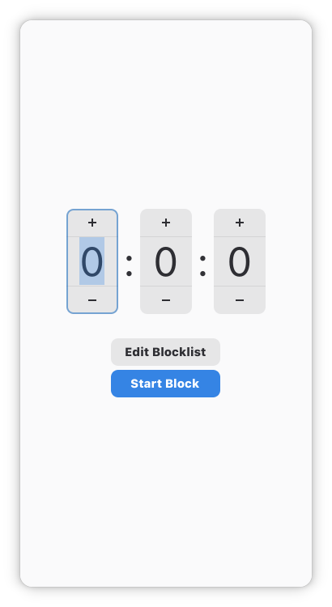
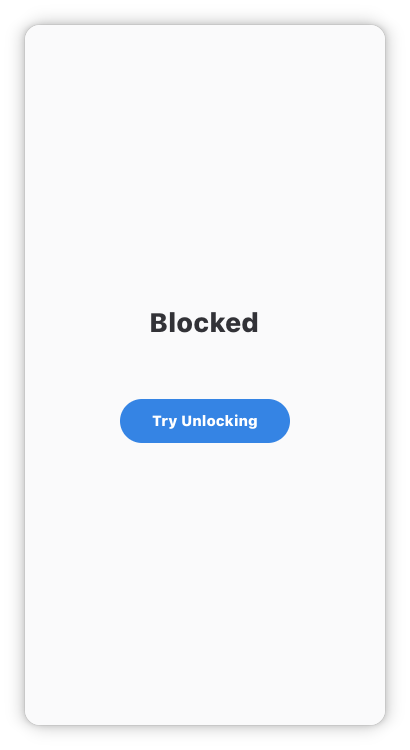

# SelfControl

CLI and GUI application that blocks distractions temporarily with no way to turn off.

Not affiliated with the popular macOS app also called [SelfControl](https://selfcontrolapp.com/).

## Supported operating systems

- Windows: CLI works, GUI needs MSYS2
- macOS: Works as intended
- Linux: Works as intended

### Windows

The CLI should work fine.
You can use MSYS2 to run the GUI application.

## Images

## Usage

`selfcontrol [edit|time format]`

Time format is time formatted like this: 1h10m10s or 25m05s or 25m5s or 5s.

## How to stop it

In case that you REALLY need it you can edit the hosts file to remove the blocked entries which is located in `/etc/hosts` on macOS and Linux or `C:\Windows\System32\Drivers\etc\hosts` on Linux